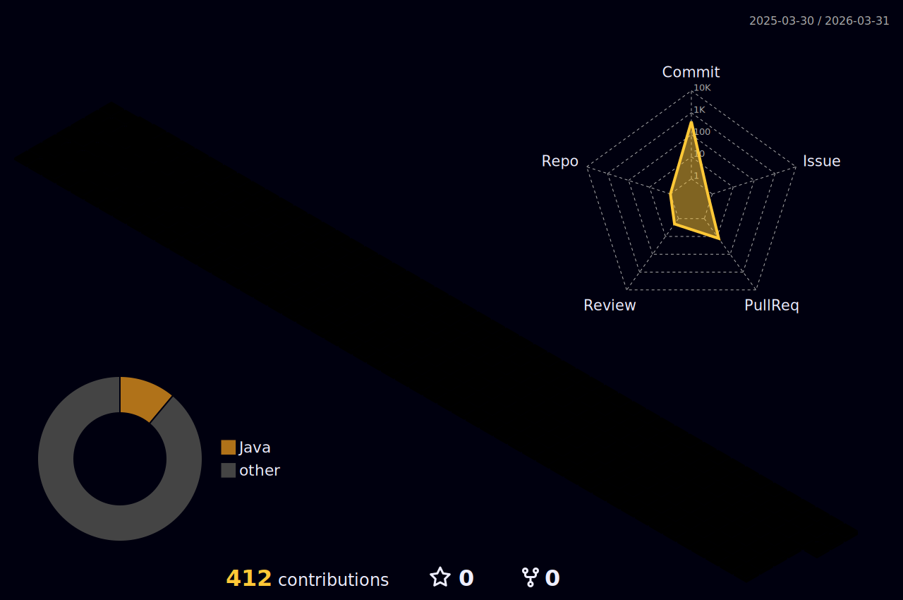

## Contact me!

## TechSkill

 
 
 
 
 
 
  
 
 

 

<!---
mim-mim-ji/mim-mim-ji is a ✨ special ✨ repository because its `README.md` (this file) appears on your GitHub profile.
You can click the Preview link to take a look at your changes.
--->

<!--## My Status
 -->

## Github

